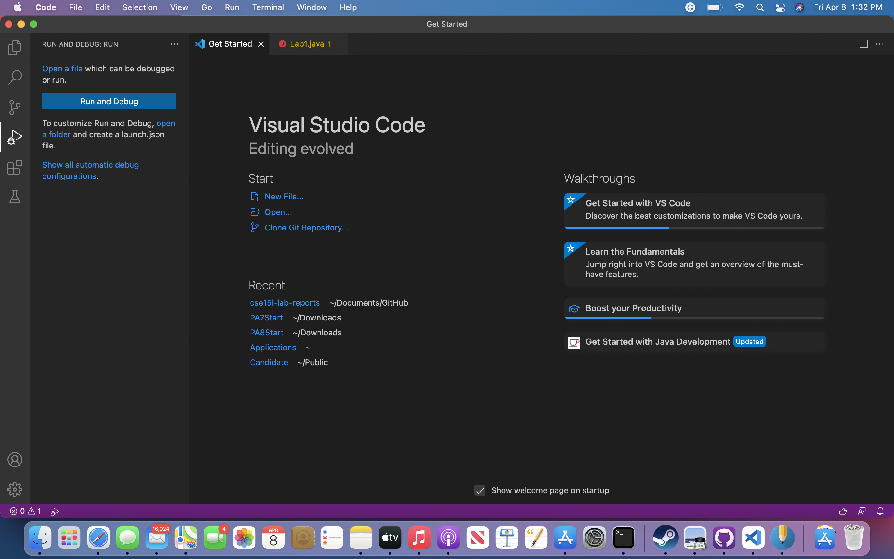

# Lab Report 1

## Installing VS Code:

In order to install Visual Studio Code, I went to code.visualstudio.com and clicked download for Mac. I opened the application and made sure that it was working correctly. 

## Remotely Connecting: 

The first step I took before logging in was changing my UCSD CSE 15L password, which I struggled with throughout Lab 1. Once I changed my passcode, I logged in using the ssh command and my account name cs15lsp22zz@ieng6.ucsd (instead of zz I used my own account). I entered my password and was asked if I want to continue connecting and responded by entering yes.

## Trying Commands

Once I was logged in, I tried entering different commands. This included cd, cd~, ls, cp, cat, and many other different commands.  

## Moving Files with SCP

First I created a file called WhereAmI.java and opened up my terminal to run the commands javac and java to test my file. Next, I ran the command scp WhereAmI.java cs15lsp22zz@ieng6.ucsd.edu:~/ (instead of zz I used my own account name.) Lastly, I logged into my account and typed in ls to check if the file was successfully moved.

## Setting an SSH Key

I was not successfully able to create an ssh key, but I was able to save my indentification in /Users/user-name/.ssh/id_rsa.pub. I did this by typing in ssh-keygen and /Users/user-name/.ssh/id_rsa into my terminal (user-name was replaced with my username). 

## Optimize Remote Running

I was able to optimize remote running by accomplishing several different tasks in one command line. For example, I put a command in quotes at the end of my login and I also seperated several commands with a semi-colon on one line. However, I was unsuccessful with the latter because I needed the file OtherMain.java in order to accomplish this task. 

