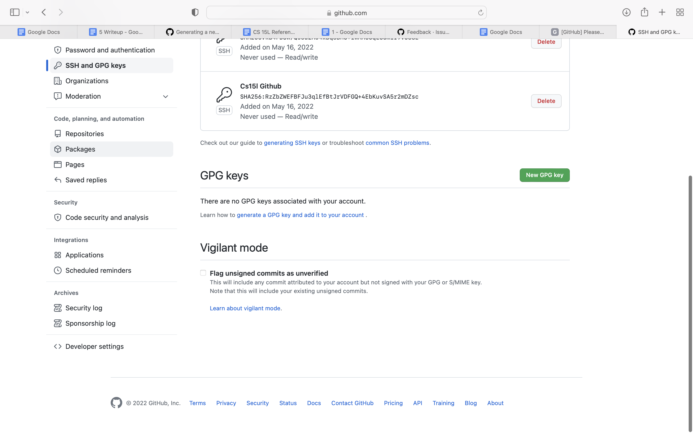
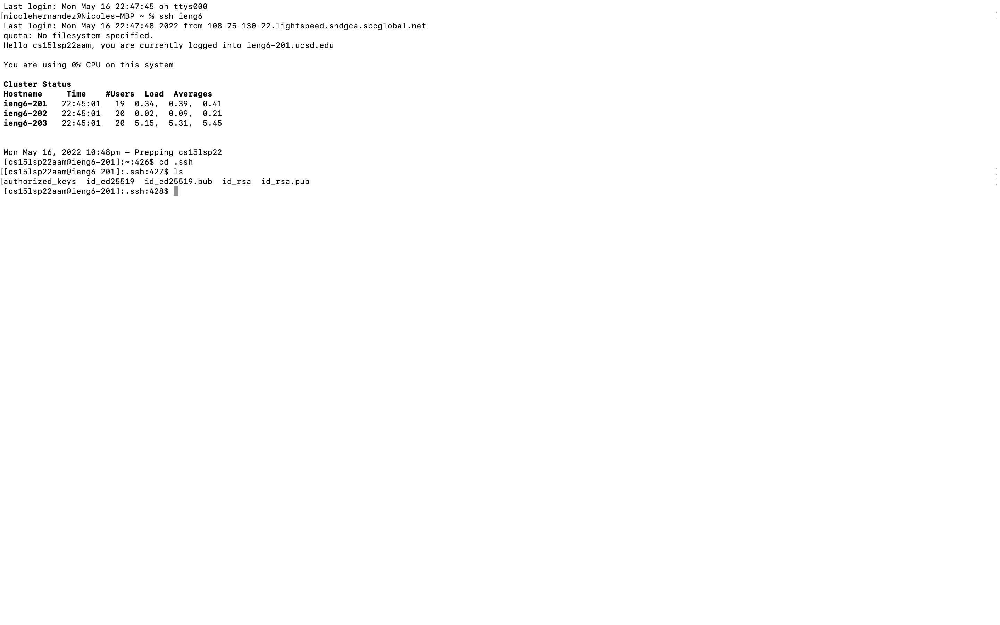
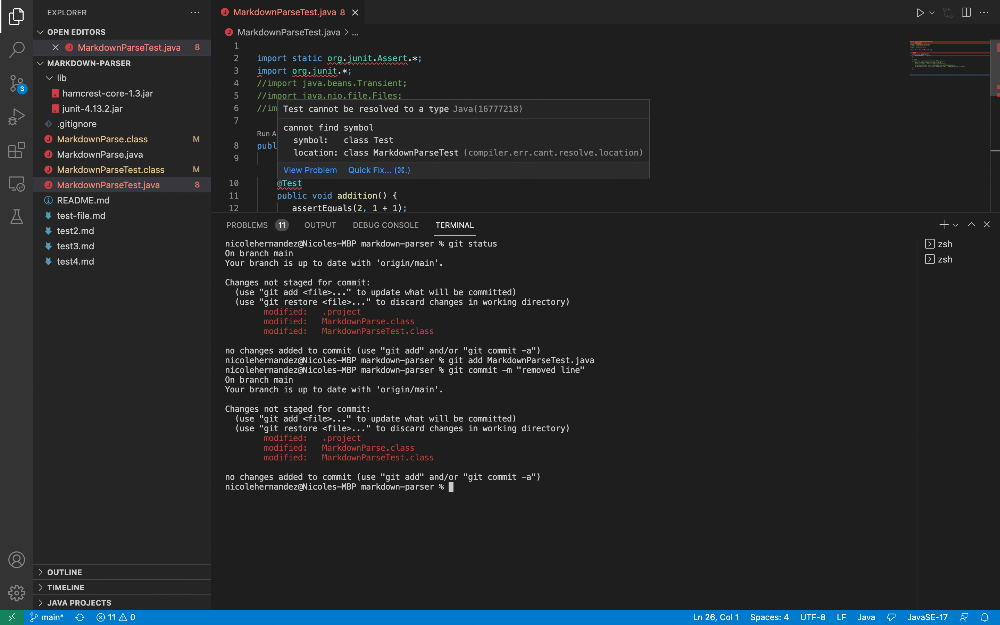
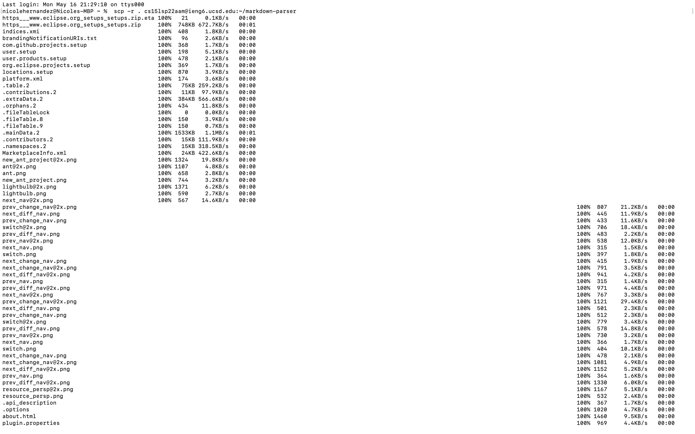
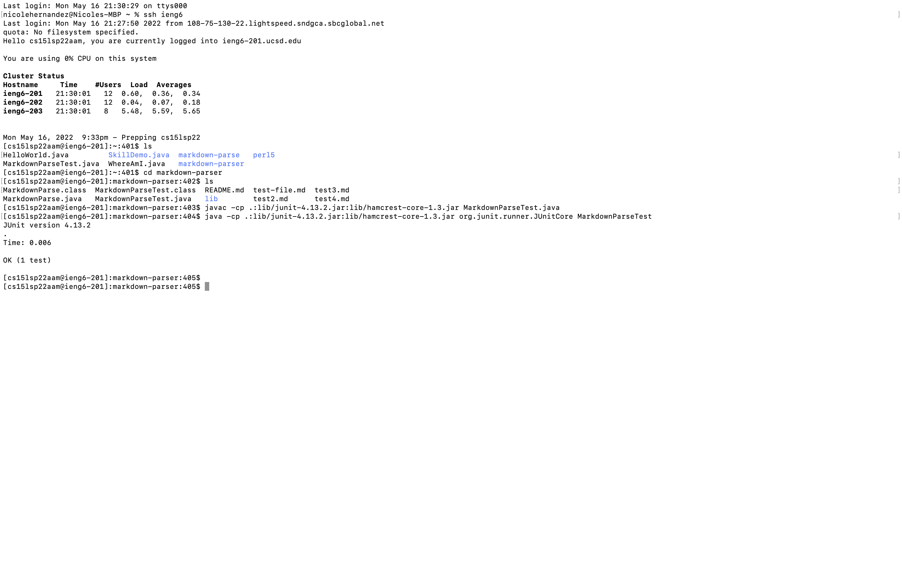
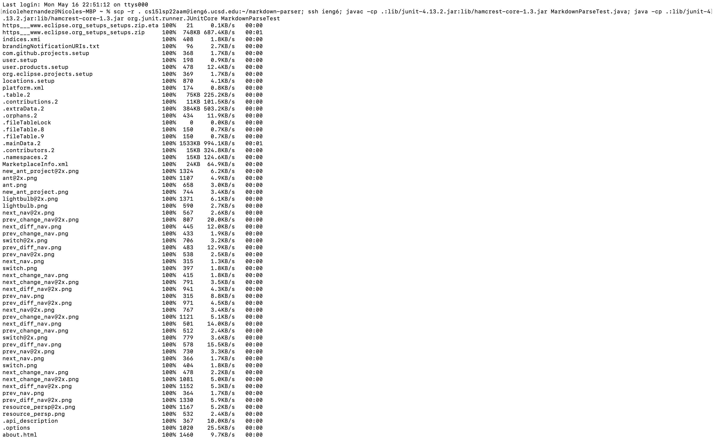

# Lab Report 3

This is my config file. I created it using the `touch config` command. It also contains entries for my github `ssh-keys`.

This is a screenshot of me logging into my `cs15lsp22` account. I did this using `ssh ieng6` with my ssh-key and config file.

This is a screenshot of me adding the file `HelloWorld.java` to my course account. I did this using the `scp` command and my alias `ieng6`. (I chose to keep this as my alias)

This is where I copied my public key to GitHub. I named it Cs15l Github.

This is where both my public and private keys are stored in my user account. My Github `ssh-key` is called `id_ed25519`.

This is where I am running git commands in my terminal. I ran `git commit` and `git push`.

This is my link for my resulting commit:
[link](MarkdownParseTest.java)

This is a screenshot of me copying the markdown-parser directory to my course account. I did this using the `scp -r` command, which recursively copies each file in a directory.

This shows me testing the `MarkdownParseTester.java` file in my course account. I have one test that executed successfully.

This screenshot shows the `scp`, `ssh`, and java commands all being run at once. This copies all the files in my directory, logs into my account, and runs my tests in succession.
