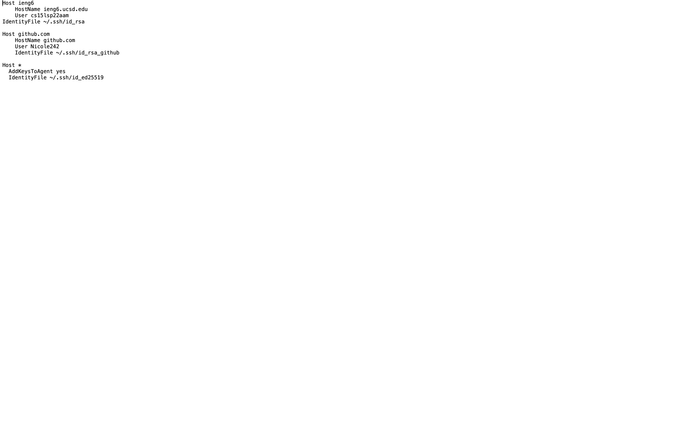
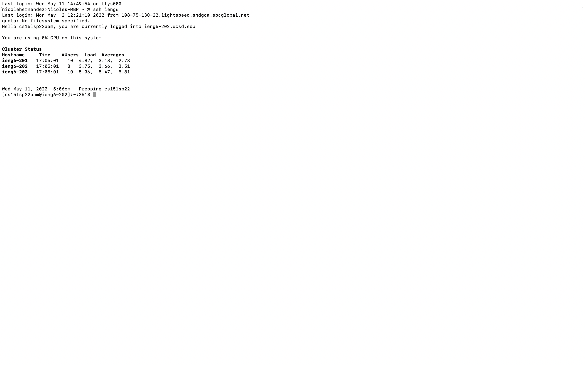
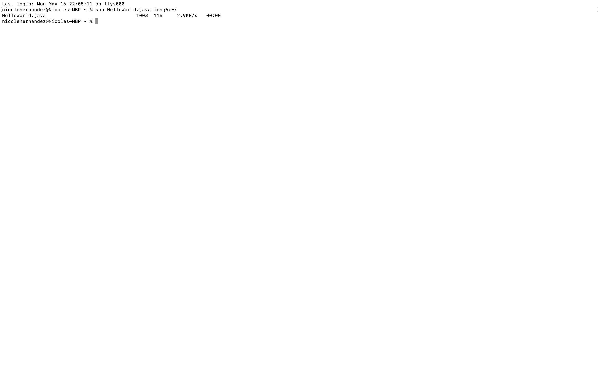

# Lab Report 3

This is my config file. I created it using the `touch config` command. It also contains entries for my github `ssh-keys`

This is a screenshot of me logging into my `cs15lsp22` account. I did this using `ssh ieng6` with my ssh-key and config file.

This is a screenshot of me adding the file `HelloWorld.java` to my course account. I did this using the `scp` command and my alias `ieng6`.

This is a screenshot of me copying the markdown-parse directory to my course account. I did this using the `scp -r` command.

