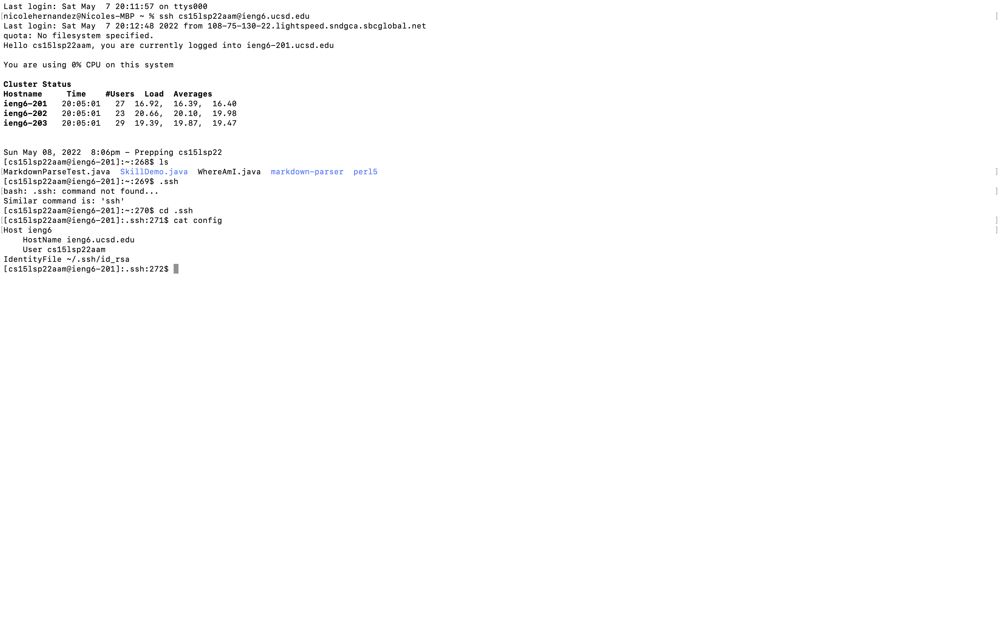
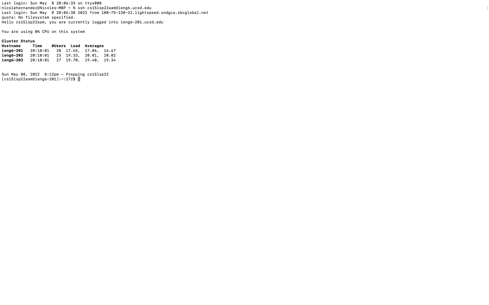
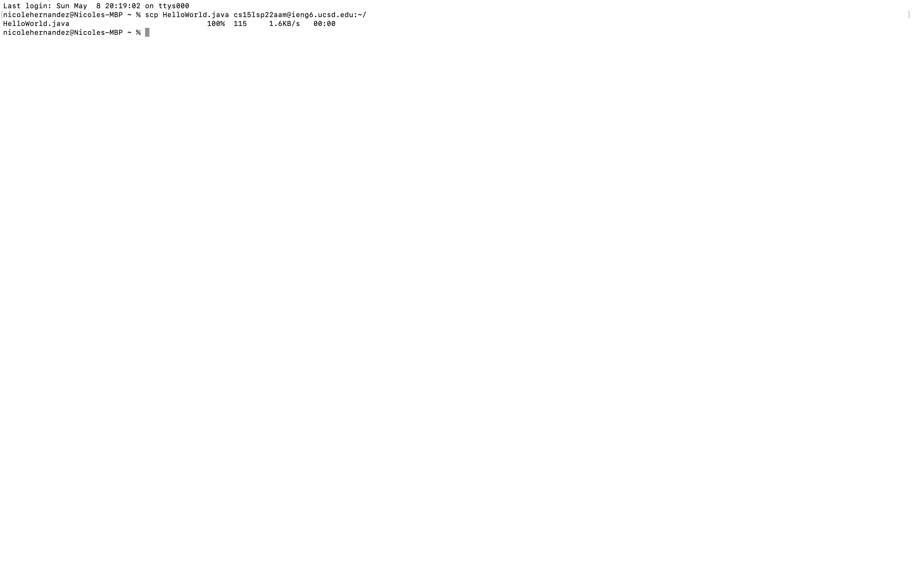

# Lab Report 3
Note: I have several different issues with my .ssh directory which include my id_rsa and id_rsa.pub files not being created/I cannot access them. Therefore most of this lab report is incomplete.

This is my config file. I created it using the `cat > config` command.

This is a screenshot of me logging into my `cs15lsp22` account. I did this using `ssh cs15lsp22` with my ssh-key.

This is a screenshot of me adding the file `HelloWorld.java` to my course account. I did this using the `scp` command.

![Image]
This is a screenshot of me copying the markdown-parse directory to my course account. I did this using the `scp -r` command.
