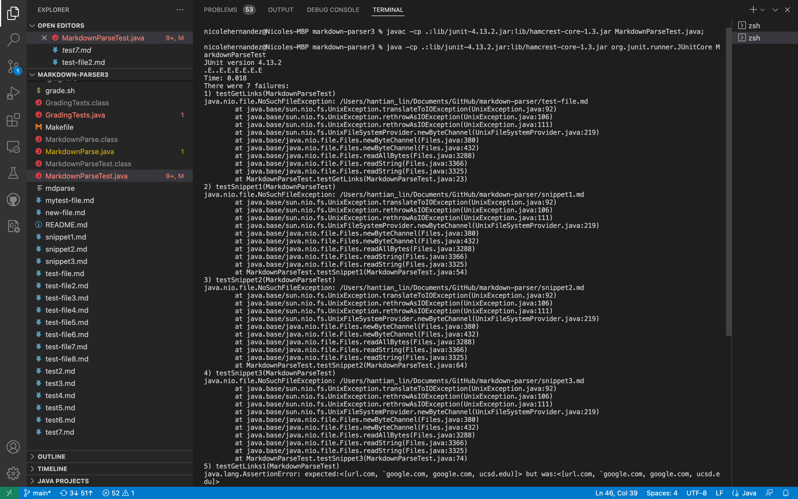
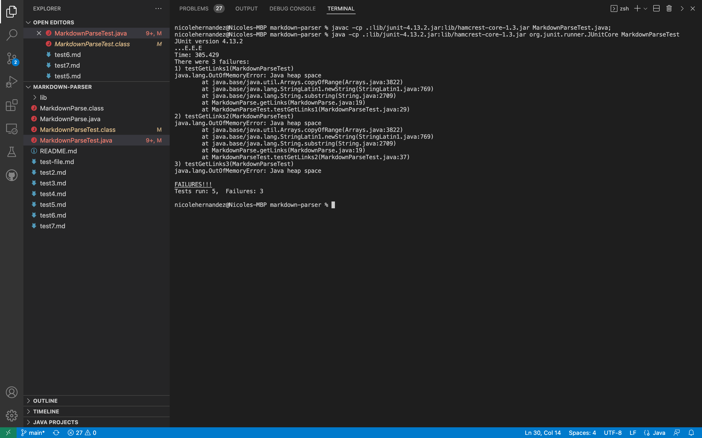
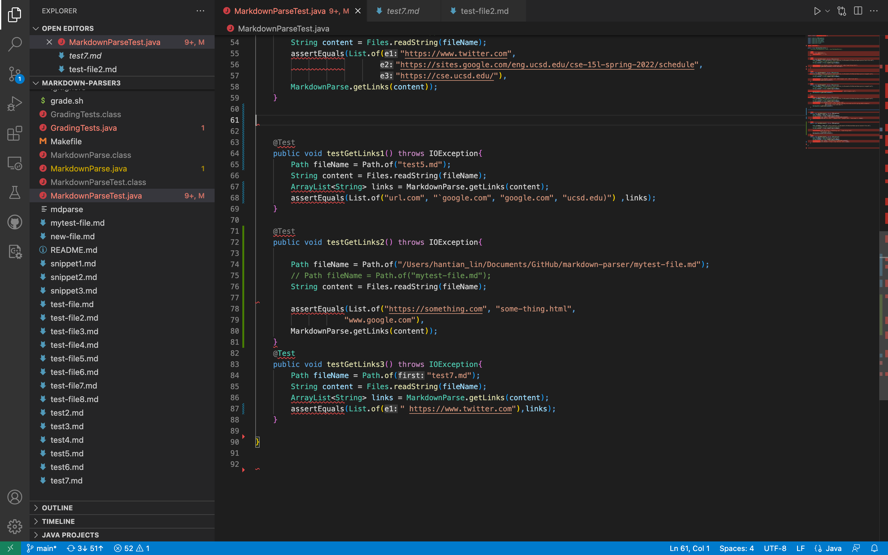

# Lab Report 4
[Link to repository from week 7](https://github.com/HantianLin/markdown-parser)

[Link to my repository](https://github.com/Nicole242/markdown-parser)

Here is what my tests looked like for each repository:

Here is my tests for the lab repository and my repository:

For snippet 1-3, each of my tests failed. 

Snippet 1: I think that for snippet 1 there is a code change that could be made.

Snippet 2: I do think that there is a code change that can be made.

Snippet 3: I do think that there is a code change that can be made.