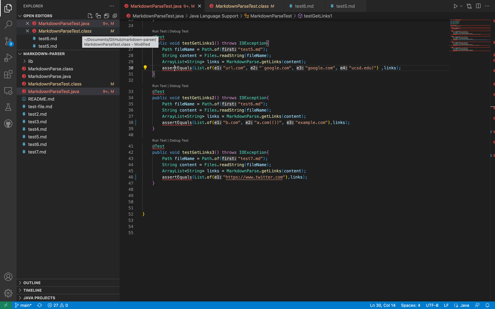

# Lab Report 4
[Link to repository from week 7](https://github.com/HantianLin/markdown-parser)

[Link to my repository](https://github.com/Nicole242/markdown-parser)

## Here is the expected output for each snippet:

Snippet 1:

`[a link`](url.com)

[another link](`google.com)`

[`cod[e`](google.com)

[`code]`](ucsd.edu)

Snippet 2:

[a [nested link](a.com)](b.com)

[a nested parenthesized url](a.com(()))

[some escaped \[ brackets \]](example.com)

Snippet 3:

[this title text is really long and takes up more than 
one line

and has some line breaks](
    https://www.twitter.com
)

[this title text is really long and takes up more than 
one line](
https://sites.google.com/eng.ucsd.edu/cse-15l-spring-2022/schedule
)

[this link doesn't have a closing parenthesis](github.com

And there's still some more text after that.

[this link doesn't have a closing parenthesis for a while](https://cse.ucsd.edu/

)

## Test Outputs:

Here is what my tests looked like for each repository:

Lab Repository:

My Repository:

Here is my code for the lab repository and my repository:

Lab Repository:

My Repository:

For snippet 1-3, each of my tests failed. 

Snippet 1: I think that for snippet 1 there is a code change that could be made to make the test execute succesfully with backticks. Since I already have my links as an ArrayList, I would need to change my filepath from the relative path `test5.md` to the path `/Users/nicolehernandez/Documents/GitHub/markdown-parser/test5.md`.

Snippet 2: I do think that there is a code change that can be made that can make my program work for nested parantheses and brackets. Since I already have my links as an ArrayList, I would need to change my filepath from the relative path `test6.md` to the path `/Users/nicolehernandez/Documents/GitHub/markdown-parser/test6.md`.

Snippet 3: I do think that there is a code change that can be made that would make my program work for newlines in brackets and parentheses. Since I already have my links as an ArrayList, I would need to change my filepath from the relative path `test7.md` to the path `/Users/nicolehernandez/Documents/GitHub/markdown-parser/test7.md`.