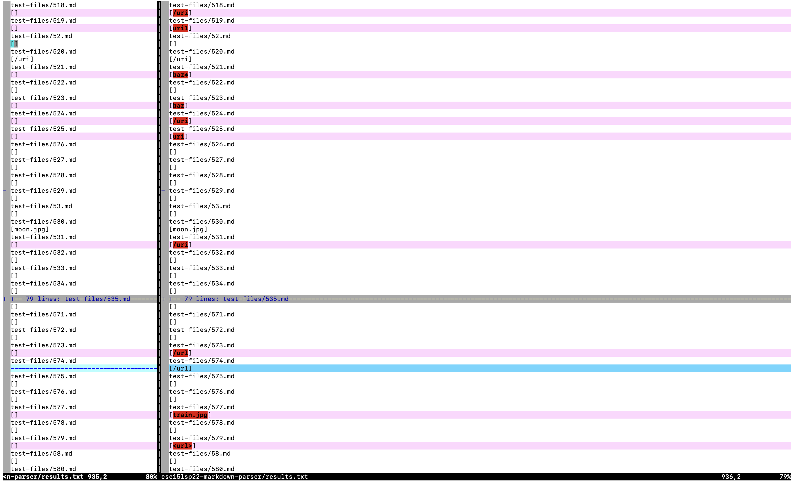
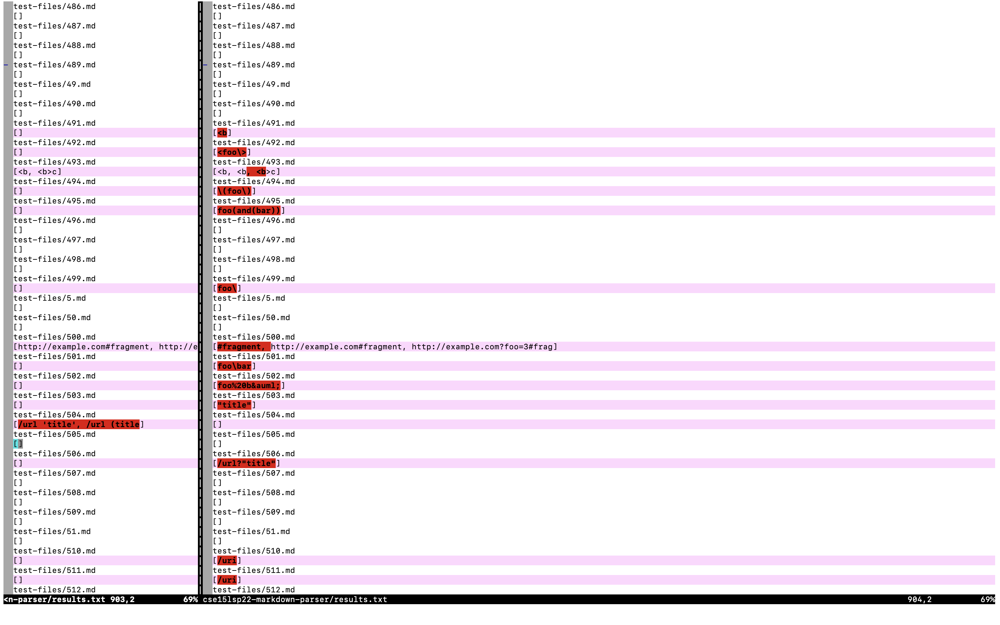
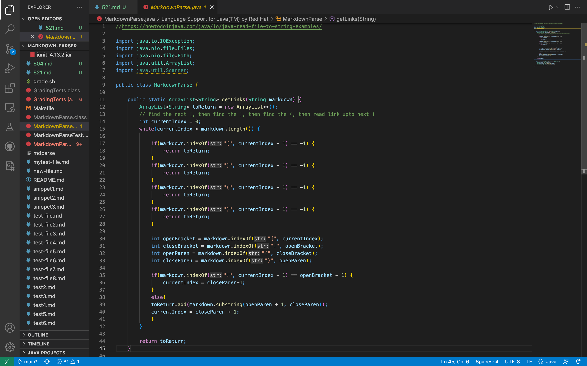

# Lab Report 5

I used the command `vimdiff my-markdown-parser/results.txt cse15lsp22-markdown-parser/results.txt` to see the results of both the provided repository and my own. 

The tests I am using are `521.md `and `504.md` which can be found in my `test-files` directory in each repository.

521.md is incorrect for implementation and gives the correct output for the lab 9 implementation. 

504.md is incorrect for my implementation and also for the lab 9 implementation. 
 

## 521.md
 Expected Output for 521.md:

 [baz*]

Output for 521.md `cse15lsp22-markdown-parser` and for `my-markdown-parser`:

 
 ## 504.md
 Expected Output for 504.md:

[/url "title", /url 'title', /url (title)]

Output for 504.md `cse15lsp22-markdown-parser` and  `my-markdown-parser`:

## Error with code:

In order to fix my code to get the correct output for 521.md, I need to add another method to my code. I need to add the method getLinks which will take a directory as a parameter. 