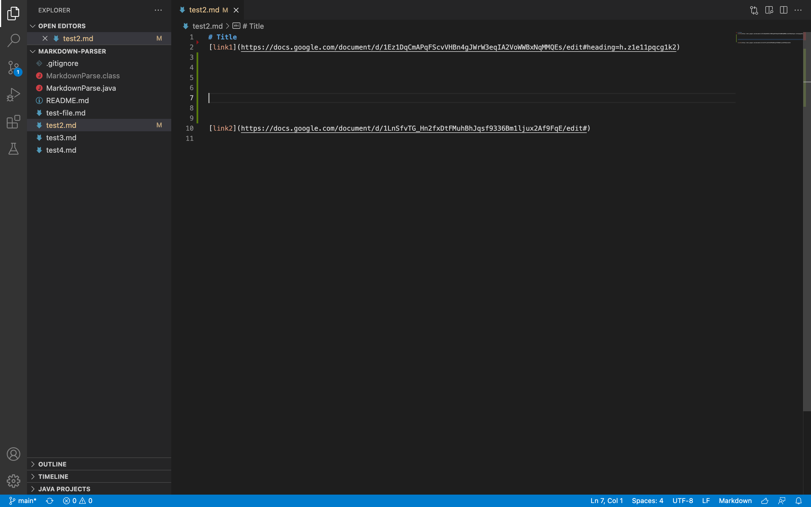
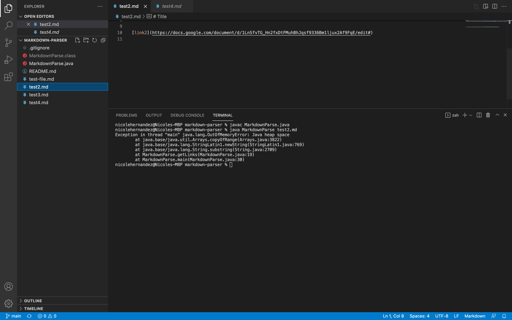
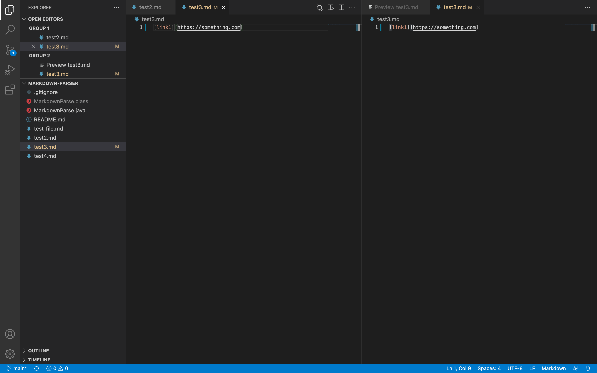
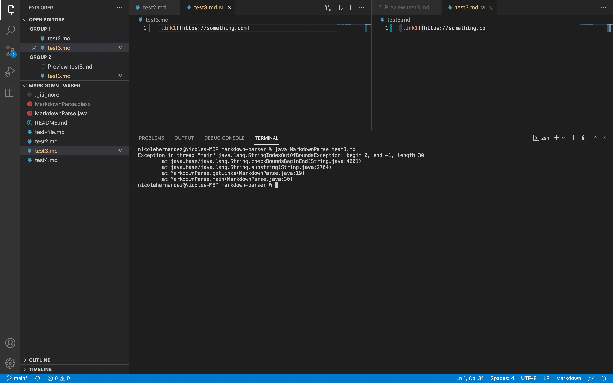
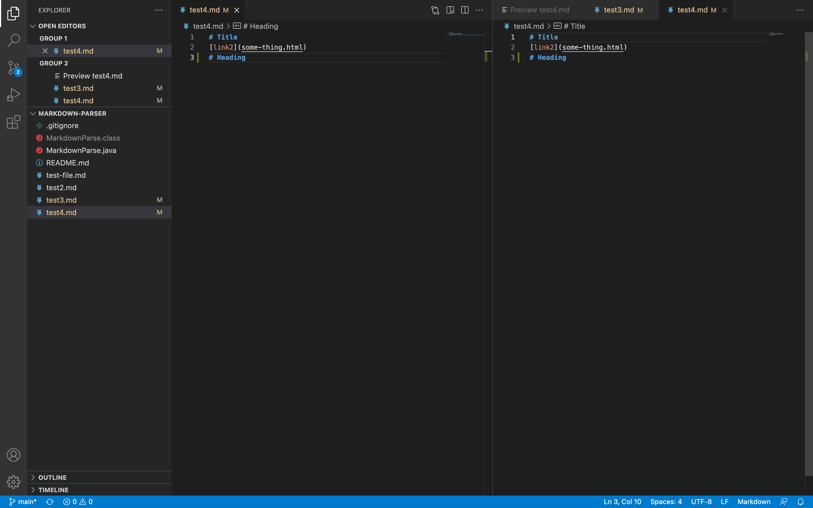
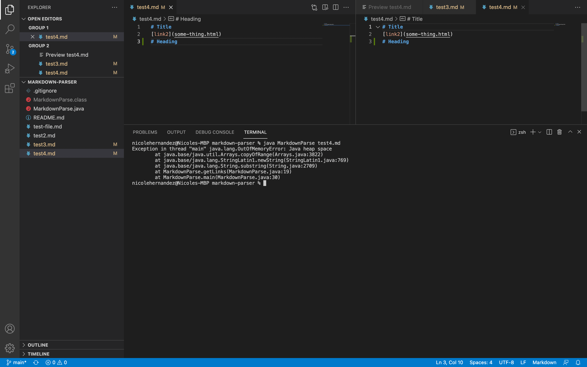

# Lab Report 2
[1]

[Failed Test #1](https://github.com/Nicole242/markdown-parser/blob/main/test2.md)

In this instance of failure, the error was caused by spacing in between each of the links. This generated a parsing error.

[2]

[Failed Test #2](https://github.com/Nicole242/markdown-parser/blob/main/test3.md)

In this instance of failure, the error was caused by using brackets instead of parentheses for the link. This caused an out of bounds error.

[3]
[Failed Test #3](https://github.com/Nicole242/markdown-parser/blob/main/test4.md)

In this instance of failure, the last line of code was a heading. This caused a parsing error to occur.

